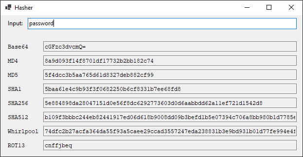

# AMS.HasherApp - Windows app for hashing text

This is a simple Windows Forms app for generating hashes of various strings. Currently supports the following types:

- Base64
- MD4
- MD5
- SHA1
- SHA256
- SHA512
- Whirlpool
- ROT13

